# Database Relationship Overview (Phase B)

Full DDL: [`database/schema.sql`](../database/schema.sql). This document is
the navigable relationship map; column-level detail lives in the SQL file's
comments.

```mermaid
erDiagram
    ROLES ||--o{ USERS : "role_id"
    ROLES ||--o{ ROLE_PERMISSIONS : "role_id"
    PERMISSIONS ||--o{ ROLE_PERMISSIONS : "permission_id"
    DIVISIONS ||--o{ USERS : "division_id (scopes DIVISION role)"

    UNITS ||--o{ ITEMS : "base_unit_id"
    ITEMS ||--o{ ITEM_UNIT_CONVERSIONS : "item_id (versioned packaging)"
    UNITS ||--o{ ITEM_UNIT_CONVERSIONS : "unit_id"
    ITEMS ||--o{ ITEM_PRICE_HISTORY : "item_id (anomaly reference series)"
    SUPPLIERS ||--o{ ITEM_PRICE_HISTORY : "supplier_id"

    ITEMS ||--o{ INVENTORY_BATCHES : "item_id"
    WAREHOUSES ||--o{ INVENTORY_BATCHES : "warehouse_id"
    SUPPLIERS ||--o{ INVENTORY_BATCHES : "supplier_id"

    WAREHOUSES ||--o{ INVENTORY_TRANSACTIONS : "warehouse_id"
    SUPPLIERS ||--o{ INVENTORY_TRANSACTIONS : "supplier_id"
    DIVISIONS ||--o{ INVENTORY_TRANSACTIONS : "division_id"
    USERS ||--o{ INVENTORY_TRANSACTIONS : "created_by"
    INVENTORY_TRANSACTIONS ||--o{ INVENTORY_TRANSACTION_LINES : "transaction_id"
    ITEMS ||--o{ INVENTORY_TRANSACTION_LINES : "item_id"
    UNITS ||--o{ INVENTORY_TRANSACTION_LINES : "input_unit_id"
    INVENTORY_BATCHES ||--o| INVENTORY_TRANSACTION_LINES : "created_batch_id (IN side)"

    INVENTORY_TRANSACTION_LINES ||--o{ FIFO_ALLOCATIONS : "transaction_line_id (OUT side)"
    INVENTORY_BATCHES ||--o{ FIFO_ALLOCATIONS : "batch_id (which layer was consumed)"

    STOCK_OPENINGS ||--o{ STOCK_OPENING_LINES : "stock_opening_id"
    ITEMS ||--o{ STOCK_OPENING_LINES : "item_id"
    WAREHOUSES ||--o{ STOCK_OPENING_LINES : "warehouse_id"
    STOCK_OPENING_LINES ||--o| INVENTORY_BATCHES : "created_batch_id (on commit)"

    STOCK_OPNAME_SESSIONS ||--o{ STOCK_OPNAME_LINES : "session_id"
    STOCK_OPNAME_LINES ||--o| STOCK_ADJUSTMENTS : "adjustment_id"
    STOCK_ADJUSTMENTS ||--o| INVENTORY_TRANSACTIONS : "transaction_id (posts as ADJUSTMENT type)"

    WAREHOUSES ||--o{ WAREHOUSE_TRANSFERS : "from_warehouse_id / to_warehouse_id"
    WAREHOUSE_TRANSFERS ||--o{ WAREHOUSE_TRANSFER_LINES : "transfer_id"
    WAREHOUSE_TRANSFER_LINES ||--o| INVENTORY_TRANSACTION_LINES : "out_transaction_line_id"
    WAREHOUSE_TRANSFER_LINES ||--o| INVENTORY_TRANSACTION_LINES : "in_transaction_line_id"

    PRODUCTION_HEADERS ||--o{ PRODUCTION_INPUTS : "production_id"
    PRODUCTION_HEADERS ||--o{ PRODUCTION_OUTPUTS : "production_id"
    PRODUCTION_INPUTS ||--o| INVENTORY_TRANSACTION_LINES : "transaction_line_id (consumes FIFO)"
    PRODUCTION_OUTPUTS ||--o| INVENTORY_TRANSACTION_LINES : "transaction_line_id (creates batch)"

    BOOK_CLOSINGS ||--o{ BOOK_CLOSING_LINES : "book_closing_id"
    BOOK_CLOSINGS ||--o{ INVENTORY_TRANSACTIONS : "book_closing_id (period lock marker)"

    IMPORT_BATCHES ||--o{ IMPORT_ROWS : "import_batch_id"

    USERS ||--o{ AUDIT_LOGS : "user_id"
```

## Design decisions worth calling out

- **`inventory_transaction_lines` is the snapshot boundary** (Section 6 of
  the brief): `item_name_snapshot`, `conversion_factor_snapshot`,
  `unit_cost_base` are all copied at post time. Nothing in reporting ever
  re-joins to current `items`/`item_unit_conversions` state to recompute a
  historical value.
- **`fifo_allocations` is the audit trail FIFO costing needs** (Section 7):
  an OUT line can point at many batches; each allocation row records
  exactly how much was pulled from which layer at what cost, so HPP is
  reconstructable batch-by-batch, not just as a rolled-up total.
- **`item_unit_conversions` is versioned, never mutated** (Section 5): a
  packaging change closes the old row (`valid_to`) and opens a new one; the
  `uq_iuc_one_open_version` generated-column unique index makes "two
  simultaneously open versions for the same item+unit" a constraint
  violation, not just a code-review concern.
- **Nothing is ever deleted.** `inventory_transactions.status` moves to
  `VOID`/`REVERSED`; `stock_adjustments` and `reversal_of_id` carry the
  correction. This directly replaces the old system's Tutup Buku behavior
  of deleting posted transactions after freezing a snapshot (Section A.5
  item 6 in the Phase A analysis).
