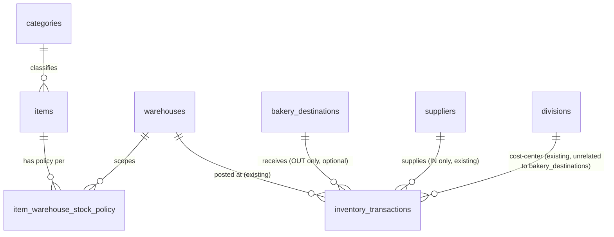

# Phase 2 — Technical Design: Inventory FIFO Pro V2

Status: **DESIGN ONLY. Nothing in this document has been executed.** No
migration has been run, no production DB touched, no code written except
this file. This is the gate the owner asked to approve before Phase 3
(Implementation) starts, per the explicit instruction: *"Jangan coding,
jangan migration, dan jangan deploy sebelum audit serta technical design
saya approve."*

Builds directly on `docs/PHASE_V2_AUDIT.md` (Phase 1, approved). Read that
first for the gap analysis this design closes.

Owner decisions incorporated (verbatim intent, confirmed this phase):
1. Categories → proper `categories` table, backfill `items.category`,
   duplicate/spelling/blank report **before** any migration, no data loss.
2. Min/buffer → backfill `items.minimum_stock` as the initial per-warehouse
   minimum for SCM and Cibadak only (the two live warehouses); never invent
   buffer values; buffer stays unset-able with a defined fallback; final
   design supports per-item-per-warehouse policy; Karang Tengah gets no
   rows (`PENDING_CUTOVER` untouched).
3. Frontend stays dependency-free vanilla JS, no bundler requirement;
   reorganize into reusable modules/components/design tokens; follow the
   dark-navy V2 mockup while preserving visual continuity with the current
   app.
4. Warehouse-isolation regression tests are an early, high-priority Phase 2
   deliverable (design here; written and run early in Phase 3, before the
   bulk of new features).

---

## 1. Final proposed schema

All changes are **additive**: no existing column is dropped, renamed, or
narrowed, and no existing table loses rows. This follows the project's
standing rule (`services/ImportMasterItemService.php`,
`services/MigrationNegativeStockService.php`, etc.) of never editing
historical/master data in place — extend, don't mutate.

### 1.1 New table: `categories`

```sql
CREATE TABLE categories (
    id          INT UNSIGNED AUTO_INCREMENT PRIMARY KEY,
    code        VARCHAR(60)  NOT NULL UNIQUE,
    name        VARCHAR(100) NOT NULL,
    is_active   TINYINT(1)   NOT NULL DEFAULT 1,
    created_at  DATETIME NOT NULL DEFAULT CURRENT_TIMESTAMP,
    updated_at  DATETIME NOT NULL DEFAULT CURRENT_TIMESTAMP ON UPDATE CURRENT_TIMESTAMP
) ENGINE=InnoDB;
```

### 1.2 `items` — additive columns only

```sql
ALTER TABLE items
    ADD COLUMN category_id INT UNSIGNED NULL AFTER category,
    ADD CONSTRAINT fk_items_category FOREIGN KEY (category_id) REFERENCES categories(id),
    ADD INDEX idx_items_category (category_id),
    ADD INDEX idx_items_name (name);
```

`items.category` (the existing free-text VARCHAR(100)) is **never dropped**
— it becomes the frozen, permanent historical record of what was imported.
`category_id` is the new normalized pointer, nullable (an item can be
"Tanpa Kategori" / uncategorized rather than forced into a guess). Once
`category_id` is populated, the UI reads/filters by it; `category` (text)
remains visible in an item's detail/audit view as provenance, never
resurfaced as if it were current classification.

### 1.3 New table: `item_warehouse_stock_policy`

```sql
CREATE TABLE item_warehouse_stock_policy (
    id              BIGINT UNSIGNED AUTO_INCREMENT PRIMARY KEY,
    item_id         INT UNSIGNED NOT NULL,
    warehouse_id    INT UNSIGNED NOT NULL,
    minimum_stock   DECIMAL(20,6) NOT NULL DEFAULT 0,
    buffer_stock    DECIMAL(20,6) NULL,        -- NULL = not configured; see Section 10 fallback rule
    is_active       TINYINT(1) NOT NULL DEFAULT 1,
    notes           VARCHAR(255) NULL,
    updated_by      INT UNSIGNED NULL,
    created_at      DATETIME NOT NULL DEFAULT CURRENT_TIMESTAMP,
    updated_at      DATETIME NOT NULL DEFAULT CURRENT_TIMESTAMP ON UPDATE CURRENT_TIMESTAMP,
    CONSTRAINT fk_iwsp_item FOREIGN KEY (item_id) REFERENCES items(id),
    CONSTRAINT fk_iwsp_warehouse FOREIGN KEY (warehouse_id) REFERENCES warehouses(id),
    CONSTRAINT fk_iwsp_user FOREIGN KEY (updated_by) REFERENCES users(id),
    UNIQUE KEY uq_iwsp_item_wh (item_id, warehouse_id)
) ENGINE=InnoDB;
```

`items.minimum_stock` (the existing single global value) is **kept as-is**
— it becomes the fallback used when no `item_warehouse_stock_policy` row
exists for a given item+warehouse (see Section 10). It is never deleted or
repurposed, so nothing that reads it today breaks.

### 1.4 New table: `bakery_destinations`

```sql
CREATE TABLE bakery_destinations (
    id          INT UNSIGNED AUTO_INCREMENT PRIMARY KEY,
    code        VARCHAR(30)  NOT NULL UNIQUE,
    name        VARCHAR(150) NOT NULL,
    address     VARCHAR(255) NULL,
    pic_name    VARCHAR(100) NULL,
    phone       VARCHAR(30)  NULL,
    notes       VARCHAR(255) NULL,
    is_active   TINYINT(1)   NOT NULL DEFAULT 1,
    created_at  DATETIME NOT NULL DEFAULT CURRENT_TIMESTAMP,
    updated_at  DATETIME NOT NULL DEFAULT CURRENT_TIMESTAMP ON UPDATE CURRENT_TIMESTAMP
) ENGINE=InnoDB;
```

### 1.5 `inventory_transactions` — one additive column

```sql
ALTER TABLE inventory_transactions
    ADD COLUMN bakery_destination_id INT UNSIGNED NULL AFTER division_id,
    ADD CONSTRAINT fk_tx_bakery_destination FOREIGN KEY (bakery_destination_id) REFERENCES bakery_destinations(id),
    ADD INDEX idx_tx_bakery_destination (bakery_destination_id);
```

**Explicitly distinct from two fields that already exist and must not be
confused with it** (this was the audit's flagged risk):
- `warehouse_id` — the internal stock location the OUT is posted from.
  Unaffected. A bakery-destination OUT still debits FIFO from a real
  warehouse exactly as today.
- `division_id` — the internal production cost-center. Unaffected. A
  transaction can have a `division_id`, a `bakery_destination_id`, both, or
  neither; they answer different questions ("which internal cost bucket"
  vs "which external delivery point") and neither implies the other.

`bakery_destination_id` is set only optionally on `OUT` transactions used
for external distribution; it is metadata only — it never participates in
FIFO costing, batch selection, or stock-effect logic.

### 1.6 `suppliers` — additive columns only

```sql
ALTER TABLE suppliers
    ADD COLUMN address VARCHAR(255) NULL AFTER contact_name,
    ADD COLUMN email    VARCHAR(150) NULL AFTER phone;
```

`code`, `name`, `phone`, `notes`, `is_active` already exist.
`contact_name` already serves as "PIC" — the V2 UI labels it "PIC /
Contact Person" rather than adding a duplicate column. This is the
"extend, don't duplicate" instruction from the spec applied concretely:
audited first (Section 6 below), only the two genuinely missing fields are
added.

### 1.7 Full DDL migration file (design, not yet created as a runnable script)

Phase 3 will produce this as `database/migrations/2026_XX_XX_v2_schema.sql`
— idempotent (`CREATE TABLE IF NOT EXISTS`, a guarded `ALTER TABLE ... ADD
COLUMN IF NOT EXISTS` equivalent via an information_schema precheck, since
MariaDB/MySQL 8 ALTER doesn't universally support `IF NOT EXISTS` for
columns) plus a companion `..._precheck.php`, `..._postcheck.php`, and
`..._rollback.sql`. See Section 13 for the exact shape. **None of these
files exist yet — this section only fixes the DDL content that Phase 3
will turn into files.**

---

## 2. ERD changes



New/changed relationships only (existing FIFO/batch/opname/transfer ERD is
untouched — see `docs/ERD.md` for the full existing diagram, which this
extends rather than replaces):

| Relationship | Cardinality | Notes |
|---|---|---|
| `categories` → `items.category_id` | 1‑to‑many, nullable | Item may be uncategorized |
| `items` + `warehouses` → `item_warehouse_stock_policy` | many‑to‑many via junction, sparse | Row exists only where explicitly configured/backfilled |
| `bakery_destinations` → `inventory_transactions.bakery_destination_id` | 1‑to‑many, nullable | OUT-only in practice, not DB-enforced (see Section 5) |

---

## 3. Category backfill strategy

Two-step, human-in-the-loop — mirrors the project's existing unit-alias
convention (`services/UnitNormalizationService`), where the system never
guesses a business classification on its own.

**Step A — distinct-value report (read-only, safe to run anytime, no
schema change required):**
`scripts/report_category_distinct_values.php` (Phase 3 deliverable) runs
`SELECT category, COUNT(*) FROM items GROUP BY category ORDER BY COUNT(*)
DESC` against the real DB, then flags:
- Near-duplicates differing only by case/whitespace/punctuation (e.g.
  "Bahan Kue" vs "bahan kue " vs "BAHAN KUE") via a normalized-key grouping
  (lowercase + trim + collapse whitespace) — reported as a merge candidate,
  never auto-merged.
- Blank/NULL categories — reported as a count, mapped to `category_id =
  NULL` (an explicit "Tanpa Kategori" bucket), not blocked or invented.
- Everything else — one row per distinct raw value with its item count.

Output: `category_backfill_candidates.csv` (raw_value, normalized_key,
item_count, suggested_group). The owner reviews this and returns an
approved mapping (raw_value → category_code/category_name, with merges
resolved explicitly).

**Step B — idempotent backfill (writes, run only after the owner approves
the mapping):**
`scripts/backfill_item_categories.php` reads the approved mapping file,
`INSERT ... ON DUPLICATE KEY UPDATE`s missing rows into `categories`, then
`UPDATE items SET category_id = :id WHERE category = :raw_value` per
mapped group. `items.category` is never modified or cleared. Re-running
the script is a no-op on rows already migrated (matches the project's
existing idempotent-import convention). A precheck refuses to run if any
`category_id` is already non-NULL for a raw value not in the mapping
(prevents partial, inconsistent re-runs).

No category is ever invented or guessed from the SKU/name — every mapping
traces to an explicit owner decision, same discipline as the
PCS↔weight packaging-conversion rule from the G-DATA phases.

---

## 4. Item × warehouse stock-policy design

- `item_warehouse_stock_policy` (Section 1.3) is **sparse by design** — a
  missing row is not an error, it's "using the fallback."
- **Backfill for SCM + Cibadak (Phase 3, per owner decision #2):**
  `scripts/backfill_stock_policy_scm_cibadak.php` inserts one row per
  (item, warehouse) pair for warehouses `SCM` and `CIBADAK` only, with
  `minimum_stock = items.minimum_stock` (the existing global value) and
  `buffer_stock = NULL` (never invented). Karang Tengah gets zero rows —
  the script hard-refuses to touch any warehouse whose `code != 'SCM' AND
  code != 'CIBADAK'`, mirroring the same explicit-scope guard pattern used
  in `scripts/production_cutover_scm_cibadak.php`.
- **Resolution order** read by the new stock-status calculation (Section
  10): `item_warehouse_stock_policy` row for this exact item+warehouse, if
  `is_active=1` → else `items.minimum_stock` + `buffer_stock=NULL`.
- **Editing**: `PUT /stock-policy` (Section 7) upserts exactly one row.
  Editing an item's policy for warehouse A never touches its row for
  warehouse B — this is the explicit "different minimum/buffer policies
  per item × warehouse" requirement.
- **STOCK-role users** may only view policy for their own scoped
  warehouse (enforced via `inv_require_warehouse_scope`, same as every
  other warehouse-scoped read); write access to `PUT /stock-policy`
  requires `STOCK_POLICY_MANAGE`, which STOCK does not hold by default.

---

## 5. Bakery destination design

- Fully separate master entity from `warehouses` and from
  `divisions` — this is the audit's flagged risk and the design's
  explicit answer to it:
  - `warehouse_id` = *where the physical stock actually sits/left from*.
    Drives FIFO. Required on every transaction, unrelated to this feature.
  - `division_id` = *internal cost-center* attribution (existing, e.g.
    which kitchen/production unit). Optional, unrelated to this feature.
  - `bakery_destination_id` = *external delivery endpoint* the OUT stock is
    headed to (e.g. a specific bakery outlet). Optional, purely
    informational/reporting metadata — set on the transaction header,
    never on `inventory_batches` or `fifo_allocations`, so it can never
    influence costing.
- Not FK-enforced to only `OUT`/`TRANSFER_OUT` at the DB level (MySQL
  can't conditionally-FK by another column's value without a trigger, and
  a trigger here would be more fragile than an app-layer check) — enforced
  in the service layer: `FifoService::postOut()` accepts and persists
  `bakery_destination_id` if present; `FifoService::postIn()` silently
  ignores it if a caller mistakenly sends it (never persisted for IN,
  matching how `supplier_id` is hardcoded NULL on the existing `postOut()`
  insert today — see `services/FifoService.php:228-231`).
- CRUD is master-data style (soft-delete via `is_active=0`, no hard
  delete), matching `suppliers`/`warehouses`/`divisions` convention and
  the "never hard-delete referenced master data" constraint — a bakery
  destination referenced by any historical transaction can be deactivated
  but never removed.

---

## 6. Treatment of existing suppliers/vendors

Audited (Section 1.6): `suppliers` already has `code`, `name`,
`contact_name`, `phone`, `notes`, `is_active`, timestamps. Genuinely
missing per the spec's ask ("address, PIC, phone, email, notes,
is_active"): only `address` and `email`. **No new table, no duplication —
extend in place.**

Currently `suppliers` is populated only via
`services/ImportSupplierService`-style CSV import (Phase G3) — there is no
CRUD UI. V2 adds:
- `GET /suppliers` — unchanged (bare array, existing consumers like
  `master.js`'s `Master.loadAll()` keep working untouched).
- `POST /suppliers`, `PUT /suppliers/{id}` — new, `MASTER_SUPPLIER_MANAGE`
  permission (new). Soft-delete via `PUT .../{id}` with `is_active:false`,
  no `DELETE` route (a supplier referenced by historical `IN` transactions
  or `items.default_supplier_id` must never be removable, only
  deactivated).
- Master Vendor UI reuses the shared data-table + drawer components
  (Section 9), not a bespoke page.

---

## 7. API contracts

All responses use the existing frozen envelope
(`{"success":true,"data":...,"message":...}` /
`{"success":false,"error":{"code":...,"message":...}}}`) —
`docs/API_CONTRACT.md` is not renegotiated. New endpoints are additive;
**no existing endpoint's response shape changes** (see the explicit
decision below on why `GET /items` is left alone rather than retrofitted
with pagination).

### 7.1 Design decision: new report endpoints, not a changed `GET /items`

The audit flagged `GET /items` as unpaginated and a real perf risk at
1000+ SKUs. The tempting fix is adding `page`/`per_page` to `GET /items`
itself — rejected, because `public/assets/js/master.js`'s `Master.loadAll()`
depends on it returning the *complete* array today for client-side
dropdowns (item pickers on the IN/OUT/Transfer/Opname forms all need the
full list). Changing its shape would be a breaking change to every
existing form, violating "stay backward-compatible." Instead:

- `GET /items` — **unchanged**, still returns the full bare array. Kept
  for dropdown/master-cache use only.
- `GET /reports/stock` — **new**, the actual paginated/filterable/sorted
  "Laporan Stok" endpoint, purpose-built for the report page and never
  used for dropdowns.

### 7.2 New endpoints

| Method & path | Permission | Purpose |
|---|---|---|
| `GET /categories` | authenticated | List active categories (id, code, name) |
| `POST /categories` | `MASTER_CATEGORY_MANAGE` | Create category |
| `PUT /categories/{id}` | `MASTER_CATEGORY_MANAGE` | Rename / activate-deactivate |
| `GET /reports/stock` | `INVENTORY_VIEW` + warehouse scope | Paginated Laporan Stok — see 7.3 |
| `GET /reports/transactions` | `INVENTORY_VIEW` + warehouse scope | Paginated IN/OUT/transfer/adjustment history — see 7.4 |
| `GET /reports/transactions/{transaction_id}` | `INVENTORY_VIEW` + warehouse scope (re-derived from the transaction's own `warehouse_id`) | Full detail: all lines, FIFO allocations, audit trail — powers the history drawer |
| `POST /suppliers` | `MASTER_SUPPLIER_MANAGE` | Create vendor |
| `PUT /suppliers/{id}` | `MASTER_SUPPLIER_MANAGE` | Edit vendor incl. `is_active` soft-delete |
| `GET /bakery-destinations` | authenticated | List active destinations (needed by every OUT form) |
| `POST /bakery-destinations` | `MASTER_BAKERY_DESTINATION_MANAGE` | Create destination |
| `PUT /bakery-destinations/{id}` | `MASTER_BAKERY_DESTINATION_MANAGE` | Edit incl. soft-delete |
| `GET /stock-policy` | `INVENTORY_VIEW` + warehouse scope | `?item_id=&warehouse_id=` → one resolved policy row (Section 4) |
| `PUT /stock-policy` | `STOCK_POLICY_MANAGE` + warehouse scope | Upsert one item×warehouse row |
| `PUT /items/{id}/category` | `MASTER_ITEM_MANAGE` (existing) | Set/clear an item's `category_id` only — narrow, scoped edit; a full item editor is out of this V2's mandatory scope |

### 7.3 `GET /reports/stock` contract

Query: `warehouse_id` (required for `STOCK` role — forced to own via
`inv_require_warehouse_scope`; optional for ADMIN/SUPERADMIN/VIEWER, who
may also omit it for a company-wide rollup), `category_id`, `q` (matches
`sku` or `name`), `status` (`SAFE|LOW|CRITICAL|OUT_OF_STOCK|
MIGRATION_NEGATIVE_REVIEW`), `include_zero_stock` (default `true` — the
spec explicitly requires zero-stock items to be visible, this is not an
opt-in), `page` (default 1), `per_page` (default 50, max 200), `sort`
(`name|sku|qty|value|status`), `dir` (`asc|desc`).

`data`:
```json
{
  "warehouse_id": 3,
  "generated_at": "2026-09-18T10:00:00+07:00",
  "rows": [{
    "item_id": 481, "sku": "100304", "name": "...",
    "category": {"id": 12, "code": "BAHAN_KUE", "name": "Bahan Kue"},
    "unit": {"id": 3, "code": "KG"},
    "qty_base": -0.5, "value": -12500.0,
    "minimum_stock": 5.0, "buffer_stock": null,
    "status": "MIGRATION_NEGATIVE_REVIEW",
    "migration_negative_review": true, "needs_stock_opname": true,
    "last_movement_at": "2026-09-01T00:00:00+07:00"
  }],
  "pagination": {"page": 1, "per_page": 50, "total": 1007, "total_pages": 21}
}
```

### 7.4 `GET /reports/transactions` contract

Query: `warehouse_id` (scope-enforced same as 7.3), `item_id`,
`transaction_type`, `date_from`, `date_to`, `supplier_id`,
`bakery_destination_id`, `q` (reference_no or item name), `page`,
`per_page`, `sort` (`date|type|item`), `dir`.

`data.rows[]` fields: `transaction_id`, `line_id`, `transaction_type`,
`transaction_date`, `reference_no`, `status`, `is_historical`,
`warehouse:{id,code,name}`, `item:{id,sku,name}`, `input_qty`,
`input_unit:{id,code}`, `base_qty`, `unit_cost_base`, `subtotal`,
`supplier:{id,name}|null` (IN only), `bakery_destination:{id,name}|null`
(OUT only), `division:{id,name}|null`, `created_by:{id,username}`.
`GET /reports/transactions/{id}` additionally returns `fifo_allocations[]`
per line (for OUT-type lines) and the matching `audit_logs` rows for that
`entity_type='inventory_transactions', entity_id={id}`.

### 7.5 Changed existing endpoint

`POST /transactions/out` gains one optional field: `bakery_destination_id`
(int, nullable). No other existing field changes meaning or requirement —
fully backward-compatible; omitting it behaves exactly as today.
Implementation touches `services/FifoService.php` lines 228-231 (add the
column + bind `$p['bakery_destination_id'] ?? null`) and the
`inventory_transaction_lines`/header insert is otherwise untouched.

---

## 8. Permission matrix

New permission codes (added to the existing `permissions` seed list in
`database/schema.sql`, following the exact same pattern already there):

| Code | Description |
|---|---|
| `MASTER_CATEGORY_MANAGE` | Create/edit categories |
| `MASTER_SUPPLIER_MANAGE` | Create/edit vendors |
| `MASTER_BAKERY_DESTINATION_MANAGE` | Create/edit bakery destinations |
| `STOCK_POLICY_MANAGE` | Set per-item-per-warehouse minimum/buffer |

Role assignment follows the existing seed pattern exactly (no new
per-role INSERT statements needed beyond adding these 4 codes to the
table — `SUPERADMIN` gets everything via its `CROSS JOIN`; `ADMIN` gets
everything **except** the existing exclusion list, which these 4 codes are
**not** added to, so `ADMIN` inherits them automatically):

| Role | New codes granted | Existing reads reused |
|---|---|---|
| SUPERADMIN | all 4 (automatic) | `INVENTORY_VIEW` (existing) covers all new report/list reads |
| ADMIN | all 4 (automatic, not excluded) | same |
| STOCK | none | `INVENTORY_VIEW` (existing) — read-only, warehouse-scoped, for `/reports/stock`, `/reports/transactions`, `/stock-policy` (GET), `/bakery-destinations` (GET) |
| DIVISION | none | `INVENTORY_VIEW` (existing) |
| VIEWER | none | `INVENTORY_VIEW` (existing) |

No existing permission is weakened or removed — this is purely additive,
satisfying "don't reduce existing security."

---

## 9. Page/component architecture

### 9.1 Navigation shift

Current: horizontal tab bar (`public/index.html` `.tabs-wrapper`/`.tab-btn`,
driven by `public/assets/js/app.js`'s `activateTab()`). V2 mockup: a
collapsible left sidebar. This is the single largest frontend change and
the audit's flagged blast-radius risk (touches every module's render
entry point) — mitigated by keeping each module's own `render(container)`
function signature unchanged; only the *navigation chrome* around it
changes.

Sidebar IA (top to bottom), permission-gated by **hiding**, not disabling,
per the spec's explicit UX rule:

- **Overview** → Dashboard (existing `dashboard.js`, extended to consume
  `InventoryService::warehouseDashboardSummary()` — already exists,
  owner's commit `30c5368`)
- **Inventory** → Stok Barang (new `stock-report.js`, `GET
  /reports/stock`), row click opens the item detail drawer
- **Transactions** → Stock IN (existing `transactions.js`, extended),
  Stock OUT (existing, extended with bakery-destination step), Transaction
  History (new `transaction-history.js`, `GET /reports/transactions`)
- **Transfers** → existing `transfers.js`, wrapped in the new nav shell
  only, no functional change
- **Stock Opname** → existing `stock-opname.js`, same
- **Reports** → existing `reports.js` (single item/warehouse ledger,
  kept as-is for that specific lookup — it is not replaced by
  `/reports/stock`, which is the "all items" view; both remain, serving
  different questions), Reconciliation (existing, `RECONCILIATION_VIEW`-gated)
- **Master Data** → Items (read list from existing `GET /items`,
  category assignment via new `PUT /items/{id}/category`), Categories
  (new `master-categories.js`), Suppliers/Vendors (new
  `master-vendors.js`), Bakery Destinations (new
  `master-bakery-destinations.js`), Warehouses/Divisions (existing
  read-only master list, unchanged), Users (existing, `USER_MANAGE`-gated
  — no change in this phase)

### 9.2 New shared components (built once, reused everywhere — this is
the "reusable modules/components/design tokens" instruction made concrete)

| File | Responsibility |
|---|---|
| `public/assets/js/sidebar.js` | Renders the nav from a declarative route list; hides entries the current role lacks permission for (reads `Auth.hasPermission`, same helper `dashboard.js` already uses) |
| `public/assets/js/data-table.js` | Generic server-side paginated/sortable/filterable table with a column-picker (persists visible-columns choice to `localStorage`, cosmetic only, never re-fetched from it); used by Stock Report, Transaction History, and every new master-data list |
| `public/assets/js/drawer.js` | Generic slide-over detail panel (item detail, transaction detail); replaces ad-hoc modal code |
| `public/assets/js/modal.js` | Confirmation/prompt modal component — the direct replacement for the two `prompt()`/`confirm()` calls in `reports.js:98,109` (Section 9.4) and for every new destructive action (deactivate vendor, etc.) |
| `public/assets/css/app.css` extended | New tokens for sidebar layout, drawer, status pills; **reuses existing `--bg/--bg2/--bg3/--card/--accent/--accent2/--green/--orange/--red` tokens** rather than introducing a new palette — this is what actually delivers "visual continuity with the current production app," since the current tokens (`#0f1117` background, blue/indigo accent) are already the same dark-navy family as the approved mockup |

### 9.3 Existing modules — adapted, not rewritten

`dashboard.js`, `transactions.js`, `transfers.js`, `stock-opname.js`,
`reports.js`, `master.js`, `production.js`, `closing.js`, `adjustments.js`,
`audit.js`, `imports.js` keep their current `render(container)` contracts
and API calls; only their markup is restyled to the new component set
where relevant (e.g. `master.js`'s bare tables become `data-table.js`
instances). This directly follows the Phase D migration guide's own
stated sequencing principle (read paths first, minimize call-site churn).

### 9.4 UX-rule compliance fix (carried in this phase, not deferred)

`public/assets/js/reports.js` lines 98 and 109 use `prompt()`/`confirm()`.
Phase 3 replaces both with `modal.js`, preserving the exact same server
calls: `InvApi.voidTransaction(transactionId, {request_uuid, reason,
superadmin_override?})`. This is a small, contained fix — explicitly
listed as a Phase 3 task rather than left implicit, since it's a concrete
finding from the audit, not a hypothetical.

---

## 10. Stock-status calculation rules

Single function, one place (matches the project's "single source of
truth" convention already used for `InventoryService`) — proposed home:
`InventoryService::stockStatus(float $qty, float $minimum, ?float $buffer,
bool $migrationNegativeReview): string`.

Evaluated in this exact order (migration-negative always wins, per policy
— it must never fold into a "normal" state):

1. `migration_negative_review === true` → **`MIGRATION_NEGATIVE_REVIEW`**
   (from `MigrationNegativeStockService::flagsFor()`, already computed
   live — reused, not recomputed).
2. `qty <= 0` → **`OUT_OF_STOCK`**
3. `qty < minimum` → **`CRITICAL`**
4. `buffer IS NOT NULL AND qty < (minimum + buffer)` → **`LOW`**
5. otherwise → **`SAFE`**

When `buffer` is unset (the common case immediately after backfill, per
owner decision #2), step 4 never matches, so the system degrades
gracefully to the 3-state `OUT_OF_STOCK / CRITICAL / SAFE` — functionally
the spec's allowed simpler `AMAN` (`SAFE`) / `TIDAK AMAN` (`CRITICAL` or
worse) fallback, without a separate code path. `minimum` here is always
the *resolved* value from Section 4 (policy row if present, else
`items.minimum_stock`), so this function never needs to know which source
it came from.

---

## 11. Reporting / query / index strategy

- **No N+1.** `GET /reports/stock` is one query: `items` LEFT JOIN a
  per-warehouse aggregated subquery on `inventory_batches` (GROUP BY
  `item_id`) LEFT JOIN `item_warehouse_stock_policy` LEFT JOIN
  `categories`. Migration-negative flags are applied in PHP after the
  query, matched against a single upfront call to
  `MigrationNegativeStockService::reviewList()` (already bounded to the
  known-whitelist size, ~8 rows today — not a per-row query).
- **`GET /reports/transactions`** is one query joining
  `inventory_transaction_lines` → `inventory_transactions` →
  `items`/`warehouses`/`suppliers`/`bakery_destinations`/`users`, filtered
  and paginated at the SQL level (`LIMIT`/`OFFSET`), never fetched-then-
  filtered in PHP.
- **New indexes** (beyond the ones already listed in Section 1):
  - `idx_items_category`, `idx_items_name` (Section 1.2) — support
    `/reports/stock`'s `category_id` filter and `q` search.
  - `idx_tx_bakery_destination` (Section 1.5).
  - Existing `idx_tx_date`, `idx_tx_type_status`, `idx_tx_warehouse`
    already cover most of `/reports/transactions`'s filters; a composite
    `idx_tx_warehouse_date (warehouse_id, transaction_date)` is proposed
    as an optional follow-up **only if real query plans show it's needed**
    (`EXPLAIN` against the actual production row counts in Phase 3
    verification) — not added speculatively.
- **Search** uses a plain indexed `LIKE 'value%'`/`LIKE '%value%'` against
  `sku`/`name` via `idx_items_name`; a `FULLTEXT` index is deliberately
  **not** proposed here — the catalog is ~1,007 SKUs, well within what a
  B-tree prefix scan handles, and FULLTEXT would be new operational
  surface (stopword tuning, relevance scoring) for a problem that doesn't
  exist yet.
- **Server-side pagination and debounce** apply to every new list
  endpoint and to `data-table.js` uniformly — no client-side filtering of
  a full dataset anywhere in V2, per the explicit performance requirement.

---

## 12. Regression-test plan (early/high-priority, per owner decision #4)

To be written and run **before** most of Phase 3's new-feature code, not
after — this was the owner's explicit prioritization.

| Test | What it proves | Where |
|---|---|---|
| STOCK user at SCM cannot read/write Cibadak inventory, transactions, opname, transfers | `inv_require_warehouse_scope` is enforced on every resource, using the resource's real `warehouse_id`, not a trusted request value — the exact class of gap the owner's own `30c5368` commit fixed | new `tests/warehouse_isolation_regression_test.php` |
| STOCK user at Cibadak cannot read/write SCM (symmetric case) | Same, opposite direction | same file |
| `GET /reports/stock` with `warehouse_id` omitted, as STOCK role | Must reject or force-scope to the user's own warehouse, never leak company-wide data to a scoped role | same file |
| `GET /reports/transactions` scope | Same pattern as above for the new history endpoint | same file |
| Stock opname session scope (`GET/POST /stock-opname/*`) | Re-confirms the owner's existing fix, now with a dedicated automated test (the audit noted none existed) | same file |
| Transfer create/receive/cancel scope | Same, for `POST /transfers*` | same file |
| Migration-negative behavior unchanged | The 5 whitelisted rows still block OUT via `NEGATIVE_MIGRATION_STOCK_REQUIRES_ADJUSTMENT`, still show `MIGRATION_NEGATIVE_REVIEW` status in `/reports/stock`, never `OUT_OF_STOCK` | extends `tests/migration_negative_stock_test.php` |
| FIFO costing unchanged | Existing FIFO test suite re-run byte-for-byte, no modification | `tests/` (existing suite, run as regression gate) |
| Company reconciliation unchanged | `ReconciliationService`/`OpeningReconciliationService` checks still pass identically pre/post schema change | existing tests re-run |
| Min/buffer calculation | All 4 status branches (Section 10) incl. the no-buffer fallback | new `tests/stock_policy_test.php` |
| Category filter/search | `/reports/stock?category_id=`/`q=` returns correct scoped subset | new `tests/reports_stock_test.php` |
| Vendor/bakery-destination filters | `/reports/transactions?supplier_id=`/`bakery_destination_id=` | same file family |
| Bakery destination persistence | Round-trips through `POST /transactions/out` → visible on `/reports/transactions/{id}` | same |

This is written as the **first** Phase 3 sub-step (Section 14, Phase 3a),
before any new schema is created, so the isolation tests run and pass
against *today's* schema first (proving the owner's existing fix is
solid), then again unchanged after the additive migration (proving
nothing regressed).

---

## 13. Migration pre-check / post-check / rollback design

Follows the exact shape already used by
`docs/PRODUCTION_CUTOVER_RUNBOOK.md` and `scripts/assert_database_clean.php`
— copy-paste commands, explicit STOP conditions, nothing destructive
without a named rollback. **Not written as runnable files in this phase**
— this section is the design Phase 3 turns into:

- `database/migrations/2026_XX_XX_v2_schema.sql` — the DDL from Section 1,
  wrapped so each `CREATE TABLE`/`ALTER TABLE` is individually safe to
  re-run (checked via `INFORMATION_SCHEMA.TABLES`/`COLUMNS` guards in the
  precheck rather than relying on `IF NOT EXISTS` where MySQL doesn't
  support it for columns).
- `scripts/v2_schema_precheck.php` — refuses to proceed if: any of the 3
  new tables already exists with an incompatible shape; `items.category_id`
  already exists; `suppliers.address`/`email` already exist (idempotency
  guard, matching `assert_database_clean.php`'s pattern); the target DB
  name doesn't match an expected pattern (same safety rail as the staging
  scripts).
- `scripts/v2_schema_postcheck.php` — verifies: all 3 new tables exist
  with expected columns; all new FKs resolve; `items.category`/
  `items.minimum_stock` row counts are **unchanged** (proves no data
  loss); row counts in every pre-existing table are unchanged.
- `database/migrations/2026_XX_XX_v2_schema_rollback.sql` — drops only
  what this migration added (`DROP TABLE bakery_destinations,
  item_warehouse_stock_policy, categories`; `ALTER TABLE items DROP
  FOREIGN KEY fk_items_category, DROP COLUMN category_id`; `ALTER TABLE
  suppliers DROP COLUMN address, DROP COLUMN email`; `ALTER TABLE
  inventory_transactions DROP FOREIGN KEY fk_tx_bakery_destination, DROP
  COLUMN bakery_destination_id`). Since every added column is nullable and
  every new table is independent, rollback never touches a row of
  pre-existing business data — this migration is reversible by
  construction, not just by intent.
- Data-backfill scripts (category mapping, stock-policy backfill) are
  **separate** from the schema migration and are individually idempotent
  and re-runnable, so a partial backfill failure never requires a schema
  rollback — only a re-run of the specific backfill script.

---

## 14. Implementation phases and dependencies (maps to Phase 3)

```
Phase 3a  Warehouse-isolation regression tests (Section 12), run against
          TODAY's schema — no dependency, can start immediately on approval.
             │
Phase 3b  Schema migration files + precheck/postcheck/rollback (Section 13),
          run against a local/staging DB only. Depends on 3a existing so the
          isolation suite can be re-run after 3b as a regression gate.
             │
Phase 3c  Category distinct-value report (Section 3, Step A) — read-only,
          can run in parallel with 3b. Owner reviews + returns mapping
          (blocks 3d, not 3b/3e).
             │
      ┌──────┴───────────────────────────┐
Phase 3d  Category backfill script     Phase 3e  Stock-policy backfill
          (needs owner mapping,                  script (SCM+Cibadak only,
          needs 3b's categories table)            needs 3b's policy table)
             │                                       │
             └──────────────┬────────────────────────┘
                             │
Phase 3f  Backend: new services (CategoryService, BakeryDestinationService,
          StockPolicyService extension of InventoryService, ReportService
          for /reports/stock and /reports/transactions) + new routes
          (Section 7) + bakery_destination_id wiring in FifoService::postOut.
             │
Phase 3g  Backend regression: full existing test suite + Section 12's new
          tests re-run against the migrated schema. Must be green before
          any frontend work starts.
             │
Phase 3h  Frontend shared components (sidebar.js, data-table.js, drawer.js,
          modal.js) + CSS token extension — built once, before any page
          that depends on them.
             │
Phase 3i  Frontend pages: Stock Report, Transaction History, Master
          Categories/Vendors/Bakery Destinations, Stock Opname/Dashboard
          restyle. modal.js swap into reports.js (Section 9.4) happens here.
             │
Phase 3j  Manual QA pass (per role: SUPERADMIN, ADMIN, STOCK@SCM,
          STOCK@Cibadak, DIVISION, VIEWER) + Playwright smoke re-run.
             │
Phase 4  Verification report (files changed, migrations created, test
          results, security tests, manual QA checklist) — per the
          spec's required Phase 4 structure.
             │
Phase 5  Deployment plan (plan-only) — per the spec's required Phase 5
          structure. No execution without explicit owner approval.
```

Nothing in Phase 3f-3j touches production. Every migration/backfill script
in 3b/3d/3e is designed to run against a local or staging database first,
exactly like the SCM+CIBADAK cutover tooling — production execution is a
Phase 5 decision, not a Phase 3 side effect.

---

## 15. Explicit scope boundaries (things this design deliberately does NOT do)

- No full item editor (name/SKU/unit/base-unit edit) — only the narrow
  `PUT /items/{id}/category`. A full item CRUD UI was not one of the 6
  mandatory requirements and would touch the locked-unit-conversion
  machinery (`items.locked_at`), which is out of scope here.
- No change to `GET /items`'s response shape (Section 7.1) — avoids a
  breaking change for zero functional gain, since `/reports/stock` covers
  the actual new requirement.
- No FULLTEXT search, no new bundler, no framework migration — matches
  owner decision #3 and avoids solving problems that don't exist yet.
- No Karang Tengah rows anywhere in the stock-policy or category backfill
  — it stays `PENDING_CUTOVER`, untouched, exactly as instructed.

---

**STOP — awaiting owner approval of this Technical Design before Phase 3
(Implementation) begins.** No migration file, no service code, no
frontend change has been written yet.
